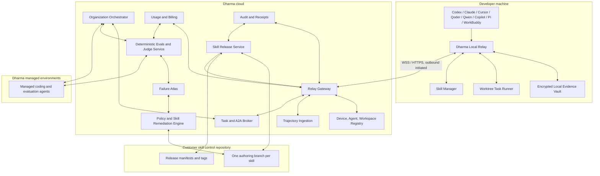
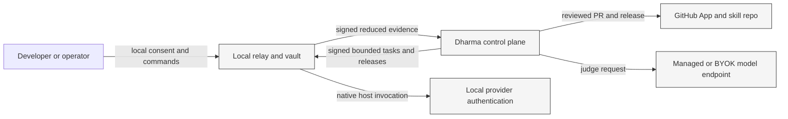
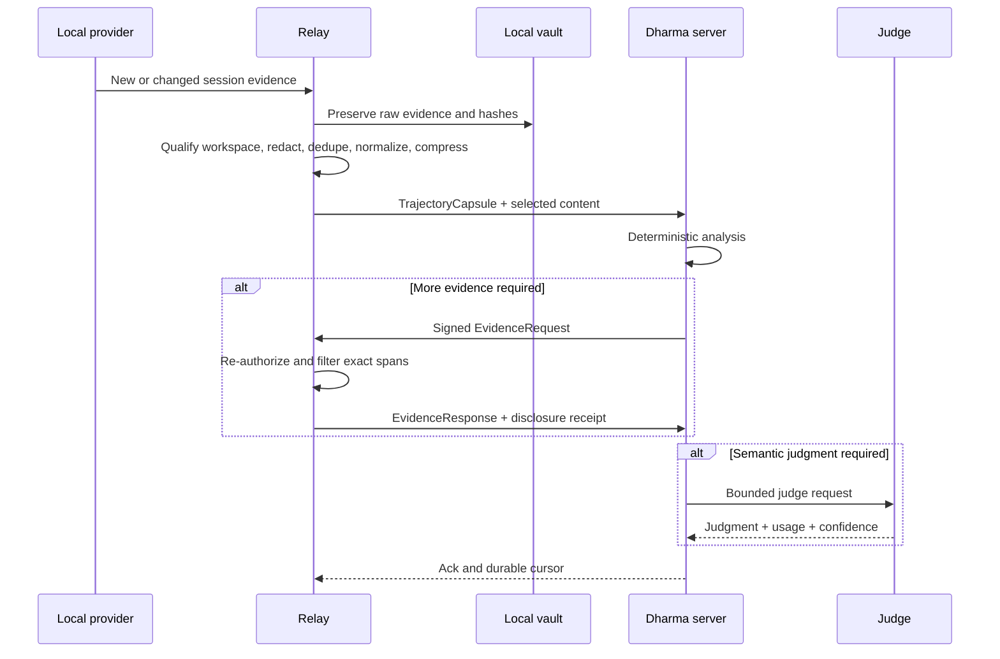
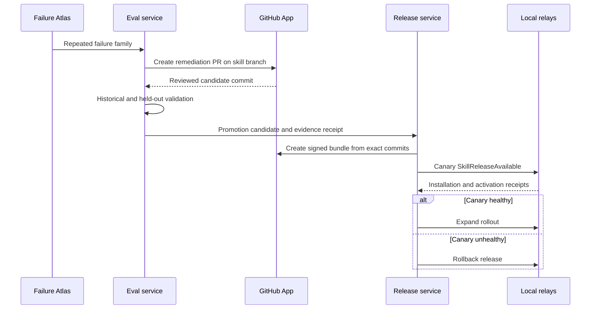

# System Architecture

## Architectural thesis

Dharma Agent Fabric is a federated control plane. Raw evidence and provider credentials remain local. Organization policy, evaluation, orchestration, skill source, and cross-team learning live in the remote control plane. The two sides communicate through signed, typed, auditable envelopes over an outbound-only connection.

## Context diagram

## Principal components

### 1. Provider adapters

Each provider is represented by independent support slices:

- source discovery;
- workspace binding;
- configured asset inventory;
- session evidence parsing;
- task execution;
- session continuation;
- skill installation target;
- activation behavior;
- usage evidence;
- cancellation and recovery.

A provider may support some slices and not others. The capability registry reports the exact state.

### 2. Local relay

The relay is a durable user-level daemon and CLI. It owns:

- device identity;
- workspace registration;
- local policy enforcement;
- trajectory collection;
- local vault and spool;
- evidence reduction;
- outbound session management;
- task execution and worktrees;
- A2A delivery;
- skill installation and rollback;
- receipts and local diagnostics.

### 3. Local evidence vault

The vault is not a plain transcript directory. It is a content-addressed evidence store with:

- encrypted blobs;
- SQLite metadata;
- source locators;
- workspace and provider binding;
- content hashes;
- retention policy;
- disclosure history;
- task and skill version lineage.

### 4. Relay gateway

The gateway terminates device connections, authenticates application-level signatures, routes messages, assigns resumable cursors, and never assumes that a connected device is authorized for every workspace or action.

### 5. Trajectory ingestion

Ingestion validates schemas, organization identity, workspace registration, retention policy, redaction receipts, content hashes, and upload limits. It stores structured metadata in Postgres and encrypted chunks in object storage.

### 6. Organization orchestrator

The orchestrator decides which local or managed agent should perform a task. It uses:

- task requirements;
- provider capability;
- workspace access;
- device presence;
- skill versions;
- budget;
- concurrency;
- authority policy;
- failure and retry history.

It does not bypass local relay policy.

### 7. Evaluation plane

The evaluation plane contains:

- deterministic evaluators;
- trace and state validators;
- rubric authoring service;
- semantic judge service;
- paired experiment runner;
- hidden-truth store;
- historical replay;
- held-out evaluation;
- regression analysis;
- cost and confidence accounting.

### 8. Failure Atlas and remediation

The client-specific Failure Atlas stores verified failure-remediation-recovery pairs with applicability boundaries. The remediation engine creates candidate changes to:

- Skills;
- rules;
- prompts;
- hooks;
- validation commands;
- policy configuration;
- task-routing logic;
- evidence collection configuration.

It never grants itself release authority.

### 9. Skill release service

The release service turns reviewed skill branch commits into signed immutable bundles, targets them to devices and providers, tracks canaries, verifies activation, and issues rollback instructions.

### 10. Managed environments

Managed environments execute tasks and judges when:

- no compatible local worker is online;
- the customer chooses Dharma-hosted execution;
- held-out evaluation needs an isolated clean environment;
- a task must run outside employee devices.

Managed and local agents use the same task, message, evidence, and skill contracts.

## Trust boundaries

### Boundary rules

- The cloud cannot read arbitrary local files.
- The local relay cannot claim a server release without verifying a Dharma signature.
- The GitHub App cannot cause local installation until a signed release exists.
- The orchestrator cannot make a device exceed its local authority policy.
- Local provider credentials never leave the device in BYOK mode.
- A judge cannot access hidden truth before the evaluated output is frozen.
- A remediation producer cannot approve its own high-risk release.

## Data flow: adaptive deep sync

## Data flow: skill remediation

## Deployment topology

### Initial deployment

- Control plane APIs: existing Dharma Next.js or Fastify service behind the organization boundary.
- Relay gateway: dedicated WebSocket service.
- Database: PostgreSQL.
- Queue and presence: Redis Streams or BullMQ for v1.
- Object storage: GCS with organization-scoped prefixes and KMS.
- GitHub integration: GitHub App.
- Evaluation workers: Cloud Run jobs or managed worker pool.
- Managed agent runners: isolated ephemeral containers.
- MCP app: separate stateless service calling the control plane.

### Scale transition

Move the relay gateway and high-concurrency workers to Kubernetes or another environment designed for long-lived connections when concurrent device count or connection lifetime exceeds the managed serverless boundary. Preserve protocol compatibility.

## Availability model

The system must continue safely during partial failure:

- Local capture continues while offline.
- Uploads resume from durable cursors.
- Tasks remain leased and idempotent.
- Skill installation never depends on an unverified partial download.
- Devices retain the last known-good skill bundle.
- The server records evidence as partial rather than silently treating absent data as healthy.
