# Adaptive Deep Trajectory Sync

## Chosen policy model

The system combines deep reduced upload and organization-authorized full-session analysis.

The local vault keeps the complete raw trajectory. The first network payload preserves as much semantic evidence as practical after:

- workspace qualification;
- secret removal;
- path and identity normalization;
- binary and cache exclusion;
- duplicate removal;
- repeated-log collapsing;
- content-addressed chunking;
- compression;
- evidence relevance ranking.

The server can request additional exact spans when a named evaluation, incident, or remediation requires them.

## Why this model

Uploading every raw byte is wasteful and risky. Uploading only aggregate metadata destroys the evidence needed for real diagnosis. Adaptive deep sync keeps the high-information content while avoiding gigabytes of dependency output, generated files, repeated code context, and irrelevant logs.

The design is inspired by local-first trajectory analysis systems such as YC Paxel, but Dharma differs in four important ways:

1. Continuous rather than one-time collection.
2. Organization-authorized reduced full-session content rather than only derived behavioral summaries.
3. Bidirectional evidence expansion and task communication.
4. Skill remediation and automatic rollout back to local agents.

## Evidence modes

| Mode | Initial upload | Expansion | Recommended use |
| --- | --- | --- | --- |
| `structured` | Normalized events, hashes, metrics, summaries | No content expansion | Strict environments or early legal review |
| `deep` | Meaningful messages, relevant tool output, diffs, validations, selected code | Bounded policy-authorized spans | Default mature deployment |
| `reduced_full_session` | Nearly complete normalized session after filtering and dedupe | Any policy-authorized local span | Default early design-partner mode |
| `incident_capture` | Complete bounded incident window plus Git and environment evidence | Full authorized forensic window | Named severe incident |

For the initial Dharma pilots, use `reduced_full_session` on explicitly registered repositories.

## Local filtering pipeline

```mermaid
flowchart LR
  Raw[Raw provider evidence]
  Qualify[Workspace qualification]
  Secrets[Secret and credential filtering]
  Scope[Path and policy exclusion]
  Normalize[Provider-independent events]
  Dedupe[Content-addressed dedupe]
  Collapse[Repeated output collapse]
  Select[Evidence relevance selection]
  Compress[Chunk and compress]
  Capsule[TrajectoryCapsule]

  Raw --> Qualify --> Secrets --> Scope --> Normalize --> Dedupe --> Collapse --> Select --> Compress --> Capsule
```



## Mandatory filtering

Always remove or replace:

- API keys and bearer tokens;
- private keys and certificates;
- database credentials and connection strings;
- cloud service-account secrets;
- `.env` values;
- authentication cookies;
- password-manager exports;
- unsupported user-home data;
- operating-system secrets;
- binary content unless an explicit artifact type permits it;
- repositories or paths outside registered scope.

Secret detectors should combine:

- known token formats;
- entropy heuristics;
- key and certificate boundaries;
- assignment-context patterns;
- optional local Gitleaks-compatible scanning;
- organization-specific secret patterns.

A detector records the secret class and replacement token, never the secret value.

## Identity and path normalization

The server generally needs stable identity, not a developer's personal home path.

Examples:

```text
C:\Users\alice\repo\src\a.ts  ->  <workspace>/src/a.ts
/home/alice/repo/src/a.ts          ->  <workspace>/src/a.ts
alice@example.com                  ->  person:hmac:<stable-org-token>
```

Pseudonymization is reversible only through an organization-controlled mapping when explicitly required. The evaluation plane should not depend on real employee names.

## Evidence that should usually remain intact

- user task requests;
- user corrections;
- agent-visible instructions;
- agent answers;
- tool names and arguments after secret filtering;
- command outcomes;
- code excerpts directly involved in a decision;
- Git diffs;
- tests, lint, typecheck, and build output;
- permission decisions;
- retries, errors, cancellations, and unresolved states;
- active skill, rule, hook, and MCP versions;
- branch, commit, and worktree state;
- agent model and provider metadata where available.

Do not paraphrase these into vague summaries before server analysis.

## Evidence reduction rules

### Collapse repeated output

Convert long repeated logs into:

```json
{
  "kind": "collapsed_output",
  "firstSample": "...",
  "lastSample": "...",
  "repetitionCount": 842,
  "contentHash": "sha256:...",
  "fullContentAvailableLocally": true
}
```

### Deduplicate code context

If the same file span is sent to the agent many times, upload the content once and refer to the content ID from every event.

### Preserve failures more deeply

Retention and selection priority:

1. security and authority violations;
2. destructive actions;
3. failed validations;
4. user corrections;
5. retries and contradictions;
6. skill or policy decisions;
7. repository mutations;
8. successful routine operations;
9. repeated informational output.

## Trajectory Capsule revisions

A long session may produce multiple capsule revisions. Each revision includes:

- stable trajectory ID;
- revision number;
- previous revision hash;
- event time window;
- selected evidence;
- local content index;
- redaction receipt;
- upload policy;
- local evidence still available;
- final or open session state.

The server treats revisions as append-only evidence, not mutable replacement.

## On-demand EvidenceRequest

A request must name:

- organization;
- device;
- workspace;
- trajectory;
- exact local content references or bounded selectors;
- purpose;
- maximum bytes;
- retention class;
- expiry;
- requester and authority;
- signature and nonce.

The relay returns:

- approved content;
- redaction and exclusion results;
- unavailable references;
- byte counts;
- disclosure receipt;
- response signature.

## Upload budgets

Each workspace policy defines:

- maximum capsule size;
- maximum daily upload;
- maximum expanded bytes per request;
- maximum retained server content;
- spool maximum;
- high-priority incident exception;
- action when a limit is reached.

Limits must not turn missing evidence into a healthy score. The server records coverage loss explicitly.

## Server-side analysis sequence

1. Schema and signature validation.
2. Deterministic event and state analysis.
3. Failure-family candidate extraction.
4. Evidence sufficiency check.
5. Additional EvidenceRequest when justified.
6. Semantic judge only when a deterministic route is insufficient.
7. Rubric or remediation proposal.
8. Historical and held-out validation.
9. Customer-facing result with precise evidence boundary.
