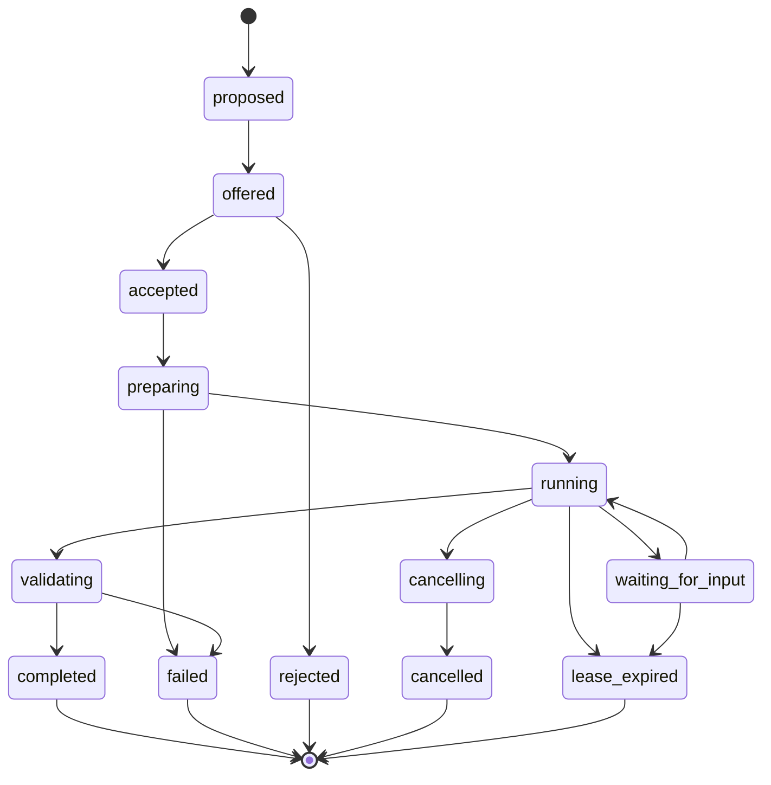

# Task Execution and Agent-to-Agent Communication

> **Implementation status:** Signed local task execution and bounded local A2A handoff are implemented for the constraints below. Broad team queues, managed-environment routing, arbitrary continuation, and speculative multi-agent selection remain target behavior unless a current capability receipt says otherwise.

## Task execution objective

The Dharma orchestrator must be able to assign bounded engineering work to any compatible local or managed agent while preserving repository isolation, provider independence, evidence lineage, cost attribution, and explicit authority.

## Task state machine



Every transition is idempotent and recorded as an event.

## TaskEnvelope

A task includes:

- organization and workspace;
- target device or selector;
- required provider capability;
- exact instruction;
- pinned skill bundle;
- evidence policy;
- read and write path policy;
- approved commands or command classes;
- network policy;
- Git behavior;
- timeout and lease;
- concurrency;
- acceptance commands;
- required artifacts;
- model execution and billing mode;
- human confirmation requirements;
- signature and expiry.

The server may select a device through a selector, but the final signed offer names the exact device and workspace.

## Default authority

A standard remote task may:

- read the registered repository;
- create an isolated Git worktree;
- modify approved repository paths;
- run approved repository commands;
- use the selected local provider's existing authentication;
- commit changes;
- push a task branch to an approved remote;
- produce evidence and artifacts.

It may not by default:

- read outside the registered workspace;
- use arbitrary user-home files;
- access unrelated repositories;
- open unrestricted network connections;
- merge to the default branch;
- modify protected branches;
- deploy;
- rotate production secrets;
- broaden its own command or path policy;
- install a new global tool without an approved dependency policy.

## Worktree lifecycle

1. Verify clean Git identity and remote.
2. Fetch the approved base ref.
3. Create `dharma/task/<task-id>`.
4. Create a worktree below the relay task directory, not inside the active developer workspace.
5. Materialize the pinned skill bundle for the task.
6. Record base commit, worktree path, provider version, policy revision, and skill bundle.
7. Start the provider through its task adapter.
8. Stream normalized events and bounded progress.
9. Run acceptance commands after the provider stops.
10. Commit only when policy and task require it.
11. Push only the task branch.
12. Preserve or delete the worktree according to result and retention policy.
13. Return a final evidence manifest.

## Provider task adapter interface

```ts
export interface ProviderTaskAdapter {
  readonly providerId: string;
  probe(context: ProbeContext): Promise<ProviderCapabilityReport>;
  prepare(request: PrepareTaskRequest): Promise<PreparedProviderTask>;
  start(task: PreparedProviderTask): AsyncIterable<ProviderRuntimeEvent>;
  sendMessage(taskId: string, message: AgentInputMessage): Promise<void>;
  cancel(taskId: string, reason: string): Promise<CancelResult>;
  collectFinal(taskId: string): Promise<ProviderTaskResult>;
}
```

A provider implementation must pin and test the installed host version or version range. Do not copy another provider's command invocation by analogy.

For Claude Code on Vertex AI, authenticate the host with Google Application Default Credentials and configure the execution shell explicitly:

```bash
export CLAUDE_CODE_USE_VERTEX=1
export ANTHROPIC_VERTEX_PROJECT_ID=<customer-project-id>
export CLOUD_ML_REGION=global
export DHARMA_CLAUDE_MODEL=claude-sonnet-5
```

`DHARMA_CLAUDE_MODEL` is passed as a single validated `claude --model` argument and is included in the execution setup rather than inferred from a mutable Claude default. Provider credentials remain local to the device.

## Command policy

A task does not receive unrestricted shell text. It receives one of:

1. An exact command approved in workspace policy.
2. A named command from the repository command registry.
3. A bounded tool action implemented by the task runner.

Example workspace registry:

```yaml
commands:
  test:
    argv: [npm, test]
    timeout_seconds: 1200
  lint:
    argv: [npm, run, lint]
    timeout_seconds: 600
  typecheck:
    argv: [npm, run, typecheck]
    timeout_seconds: 600
```

The provider may propose a new command, but the relay must request approval or reject it according to policy.

## Network policy

Modes:

- `deny`
- `package_registry_only`
- `allowlisted_domains`
- `inherit_local_provider`

The initial default for server-initiated tasks is `deny`, except for the provider's native authenticated service and the approved Git remote. Dependency installation requires explicit policy.

## Streaming evidence

Task progress should transmit:

- lifecycle transitions;
- user-visible agent messages;
- tool names and bounded arguments;
- command start and result summaries;
- file mutation summaries;
- validation results;
- permission requests;
- errors and retries;
- A2A messages;
- cost or usage evidence when available.

Do not stream full command output repeatedly. Store locally and upload selected or requested spans.

## Human interaction

The task may enter `waiting_for_input` when:

- a product decision is genuinely unresolved;
- new authority is required;
- the provider asks a question;
- a secret or credential must be supplied through an approved channel;
- acceptance evidence conflicts.

The server or a human can reply through an `AgentMessage`. The reply becomes part of the task trajectory.

## Agent-to-agent protocol

An `AgentMessage` contains:

- organization;
- conversation and task;
- source and target agent identities;
- source and target environments;
- prose content;
- structured state;
- evidence references;
- requested response type;
- authority;
- delivery expiry;
- budget;
- signature.

For the current public `dharma.task/v1` contract, a structured `stateEnvelope` is required only when `taskType` is `a2a_handoff`. It contains:

- `intent`;
- `evidence_used`;
- `known_state`;
- `unknown_or_missing_state`;
- `allowed_next_actions`;
- `blocked_actions`;
- `decision_authority`;
- `tool_results`.

The handoff also requires source task and endpoint identity plus bounded evidence references. The schema contains no `final_action` field. Passing schema and authority checks does not establish that the evidence is true or that the reasoning is valid.

### Example structured handoff

```json
{
  "status": "blocked",
  "failedGates": ["heic_integration_test", "visual_diff_threshold"],
  "missingAuthority": ["engineering_owner_approval"],
  "permittedActions": ["inspect_failure", "prepare_patch", "rerun_tests"],
  "forbiddenActions": ["deploy", "tell_customer_resolved"],
  "requiredRecovery": [
    "fix orientation regression",
    "pass integration and visual tests",
    "obtain engineering owner approval"
  ]
}
```

The receiving agent must not infer authority from prose when structured authority is present.

## Routing

The current HQ route supports same-organization, same-workspace dispatch to a different active local endpoint. It requires a structured requested response and defaults to read-only, no-command, no-network authority. The broader selectors below are planned routing targets, not all current production capabilities.

The broker can target:

- a specific agent instance;
- any online agent with a provider capability;
- a team or workspace queue;
- a managed environment;
- a human approval queue.

Routing decisions preserve why the target was chosen.

## Offline delivery

- Messages use durable leases.
- A target may accept after reconnect if the message has not expired.
- Task-critical messages receive delivery and application acknowledgements.
- The orchestrator may reroute only when the message contract allows it.

## Speculative execution

Do not enable by default. When explicitly enabled, multiple agents may receive the same read-only or isolated task. Their branches and trajectories remain separate. A separate selector compares results. No agent may see another candidate before its own output freezes unless the task is designed as collaboration.

## Completion evidence

A completed task returns:

- final state;
- base and final commit;
- task branch;
- diff summary and hash;
- acceptance command results;
- provider and model metadata;
- pinned skill bundle;
- trajectory capsule IDs;
- unresolved issues;
- cost evidence;
- artifact manifest;
- local and server receipts.
