# Dharma Agent Fabric: company onboarding and operation

This guide is for a company administrator connecting local coding agents and production agents to Dharma. It covers the customer-controlled journey from self-service registration to observable execution, automatic evaluation, remediation, signed rollout, and rollback.

## What the customer receives

- an organization workspace at `https://www.dharma-ai.io/portal`;
- a private, organization-owned agent-control repository created through the Dharma Remediation GitHub App;
- a scoped organization API key for the public HQ API;
- the open-source `@dharma-ai-labs/agent-fabric` CLI;
- repository-local instructions and policy for Codex, Claude Code, and Agy;
- one selected execution boundary: Dharma-managed ADK, GCP Vertex BYOK, or local BYOK;
- encrypted local evidence capture and reduced trajectory synchronization;
- exact 100-trajectory analysis windows, versioned rubrics, and an organization-isolated Failure Atlas;
- evidence-linked remediation pull requests, held-out evaluation, signed skill bundles, canary installation, and rollback;
- usage and credit records scoped to the organization.

Customer tokens authenticate only to Dharma HQ. They never expose a GCP service account, internal worker URL, model-provider credential, relay secret, or another tenant's resource.

## The autonomous lifecycle

```mermaid
flowchart LR
  A[Open dharma-ai.io/subscribe] --> B[Register account and select trial or production]
  B --> C[Install GitHub App]
  C --> D[Private control repo created]
  D --> E[Choose managed, GCP BYOK, or local BYOK]
  E --> F[Create scoped API key]
  F --> G[Run dharma onboard]
  G --> H[Outbound relay and reduced trajectories]
  H --> I[Exact 100-trajectory window]
  I --> J[Rubrics and Failure Atlas]
  J --> K[Remediation PR and held-out gate]
  K --> L[Signed 10 percent canary]
  L --> M{Installation receipt}
  M -->|active| N[Automatic expansion]
  M -->|failed| O[Automatic rollback]
```



Two steps require explicit customer consent because GitHub and Google forbid a vendor from granting itself authority:

1. the company admin installs the GitHub App into the selected GitHub organization;
2. for GCP BYOK only, a company cloud admin applies the generated Workload Identity Federation IAM bindings.

The dashboard performs or monitors the remaining work.

## 1. Register, start a trial, or purchase production access

1. Open [dharma-ai.io/subscribe](https://www.dharma-ai.io/subscribe).
2. Select **Start local-agent trial** or **Register full account**.
3. Create or sign in to the Clerk account that will become the first organization owner.
4. For a trial, accept the 50,000-credit local-BYOK entitlement. No payment or invitation is required.
5. For production, complete the Stripe checkout for the USD 1,000 package containing 5,000,000 Dharma credits.
6. Return to the same organization in the HQ portal. The onboarding workspace resumes at its durable current stage.

The trial is limited to local BYOK execution. Managed environments, cloud BYOK, or a bespoke BigLaw/TypeDB integration require production activation or a separately recorded sponsored canary. Bespoke integration work is quoted as a fixed fee after the initial seam audit; it is not included in the platform credit package.

Production Agent Fabric activates only after the signed Stripe webhook records the eligible paid package. A separately recorded sponsored canary can replace payment for an approved proof tenant.

Clerk and Stripe have separate responsibilities in this flow. Clerk establishes the person, organization membership, and administrator authority. Stripe hosts payment collection and supplies the signed payment event. Dharma HQ verifies that event and writes the immutable order, invoice, credit-pool, and activation records. This separation avoids adding a Clerk Billing fee to Agent Fabric usage and preserves Dharma's per-run credit settlement.

After payment, return to the same organization in the dashboard. The onboarding stage advances automatically after the verified Stripe webhook is processed; the customer does not upload a receipt or ask an operator to mark the order paid. Clerk establishes identity and organization authority; it does not substitute for the Stripe payment record.

The onboarding page shows the exact order if payment is incomplete. It does not treat an issued or accepted order as paid.

## 2. Connect GitHub

Select **Connect GitHub** in Agent Fabric onboarding. GitHub opens the Dharma Remediation App installation screen.

Choose the company's GitHub organization and approve only the repositories intended for Dharma. After the callback succeeds, the dashboard creates a private repository named `<company-slug>-agent-control` containing:

- `.dharma/agent-fabric.json`: organization and API coordinates, no secret;
- `AGENTS.md`: safe coding-agent behavior;
- `policies/`: approved policy history;
- `skills/`: remediation skill history;
- `tests/`: visible evaluation contracts;
- `.github/workflows/dharma-remediation-gates.yml`: repository and secret checks;
- `docs/DHARMA_AGENT_FABRIC.md`: company-specific start guide.

Hidden evaluation truth, customer API keys, provider credentials, and raw local trajectories are never committed.

## 3. Select an execution boundary

### Dharma-managed ADK

Choose **Dharma managed** and a spend ceiling of no more than the amount shown by the dashboard. The control plane creates a tenant-labeled GCP workload project, runtime identity, Agent Development Kit runtime, log/trace resources, and budget controls. Provisioning is asynchronous; the dashboard polls the job until it is ready or returns a specific error.

Runs are submitted to HQ and return a durable `runId`. The browser and SDK poll HQ for state and events. They do not call GCP directly.

### GCP Vertex BYOK

Choose **GCP Vertex BYOK** when the company owns the runtime project. Enter the project ID, project number, region, runtime service name, HTTPS runtime URL, and invocation service account.

The dashboard generates exact `gcloud` IAM commands binding Dharma's Vercel OIDC identity through Workload Identity Federation. A company cloud admin runs those commands, then selects **Verify**. No service-account JSON key is created or uploaded.

The customer pays Google for model/runtime use. Dharma records and charges only evaluation, orchestration, storage, tracing, and other explicitly metered Dharma services.

### Local BYOK

Choose **Local BYOK** when model credentials and execution must remain on employee devices. The relay sends signed, bounded task envelopes; the local provider uses its existing credentials. Dharma charges no provider-token usage for local execution. Semantic judging and control-plane work remain metered.

## 4. Create the organization API key

Open **Developer API > Keys**. Create one key per automation boundary rather than sharing a human key.

Typical scopes:

- local relay: `agents:read`, `agents:run`, `traces:read`, `skills:read`, `skills:write`;
- CI evaluation: `agents:read`, `agents:run`, `evals:read`, `evals:run`, `traces:read`, `usage:read`;
- read-only operations: `agents:read`, `evals:read`, `traces:read`, `skills:read`, `usage:read`.

The complete token is displayed once. Store it in the operating-system secret manager or CI secret store. Do not put it in Git, `.env.example`, logs, screenshots, issue text, or a chat transcript.

## 5. Connect local Codex, Claude Code, and Agy

Prerequisites:

- Node.js 22.20 or later;
- Git;
- one supported provider installed and authenticated locally;
- a clean source repository;
- browser access to the signed-in Clerk organization.

Install the public CLI:

```bash
npm install --global @dharma-ai-labs/agent-fabric
dharma --version
```

The dashboard shows this install command only after the exact version is available from npm and its signed GitHub Release. A **CLI release gate pending** notice means the operator proof may use a reviewed source checkout, but the customer installation path is not yet released and onboarding must not be described as GA.

Copy the organization-specific command from the dashboard and run it inside the source repository:

```bash
dharma onboard \
  --hq-url https://www.dharma-ai.io \
  --organization-id <organization-id> \
  --policy-revision agent-fabric-policy-v1 \
  --workspace .
```

The CLI opens a short-lived browser approval page. After the company user approves the device, the CLI:

1. creates an Ed25519 device identity sealed by the operating-system credential store;
2. registers a workspace using hashes rather than disclosing its absolute local path;
3. detects Codex, Claude Code, and Agy independently;
4. writes `.dharma/approved-policy.json` with registered commands and bounded write paths;
5. installs `.agents/skills/dharma-agent-fabric/SKILL.md` and the organization API coordinates;
6. reports evidence, task, continuation, skill-installation, activation, and rollback capabilities separately.

Preview what can leave the device:

```bash
dharma providers list
dharma evidence preview \
  --workspace . \
  --provider codex \
  --policy .dharma/approved-policy.json \
  --maximum-sessions 20
```

Synchronize reduced evidence:

```bash
dharma evidence capture-batch \
  --workspace . \
  --provider codex \
  --policy .dharma/approved-policy.json \
  --maximum-sessions 20 \
  --sync
```

The policy-qualified preview reports the exact automatic-capsule bytes and disclosed/excluded content classes. Automatic capsules contain event kinds, timestamps, coverage, source kinds, record sizes, and pseudonymous identifiers only. Prompt/response text, instructions, tool schemas and I/O, execution configuration, token/rate metadata, encrypted reasoning, and local paths remain on the device unless a separate bounded evidence request is explicitly approved.

Batch capture is deliberately bounded. Use `--maximum-sessions` after reviewing the preview counts, or pass a JSON `--session-ids-file` to select exact sessions.

Use `claude` or `agy` as the provider only after the capability report says the required lifecycle is available. Provider evidence support alone does not imply remote task or skill activation support.

Start the outbound relay:

```bash
dharma relay start --policy .dharma/approved-policy.json
```

The relay has no inbound listener. Its local execution gate deterministically verifies the signed task identity, organization and workspace binding, target device and provider, signature, expiry, replay nonce, read and write paths, registered command IDs and canonical arguments, network policy, Git mode, budget, execution lease, pinned skill bundle, and relay-owned Git-worktree isolation.

That gate enforces delegated authority. It does not semantically determine whether the agent's rationale is valid or whether its conclusion follows from the evidence.

## 6. Call a managed or BYOK agent through the SDK

Install the TypeScript client:

```bash
npm install @dharma-ai-labs/agent-fabric-sdk
```

Submit a multimodal garment appraisal:

```ts
import { createHash } from 'node:crypto';
import { readFile } from 'node:fs/promises';
import { AgentFabricClient } from '@dharma-ai-labs/agent-fabric-sdk';

const image = await readFile('./evidence/jacket-front.jpg');
const client = new AgentFabricClient({
  organizationId: process.env.DHARMA_ORG_ID!,
  token: () => process.env.DHARMA_ORG_API_TOKEN!,
});

const submitted = await client.submitManagedRun({
  agentId: process.env.DHARMA_AGENT_ID!,
  prompt: 'Estimate a bounded resale range. Use only the supplied image, label, condition notes, and comparable-sale evidence. Name missing evidence and do not present an unsupported exact price.',
  attachments: [{
    displayName: 'jacket-front.jpg',
    mimeType: 'image/jpeg',
    dataBase64: image.toString('base64'),
    sha256: `sha256:${createHash('sha256').update(image).digest('hex')}`,
  }],
  metadata: {
    condition: 'visible cuff wear; lining intact',
    comparableSales: [{ currency: 'USD', amount: 220, source: 'customer-supplied-record-17' }],
  },
});

console.log(submitted.runId);
```

The image is validated by MIME type, magic bytes, size, and SHA-256. HQ stores attachment receipts, not the raw base64 payload. Use `getManagedRun(runId)` and `getManagedRunEvents(runId)` for durable status and trace events.

The Python package is `dharma-agent-fabric-sdk` and exposes the same organization-scoped methods.

## 7. Send structured cross-agent help

A support agent that discovers a product bug can ask an online coding endpoint for a bounded proposal. It cannot grant itself deployment or unrestricted file authority.

```ts
await client.dispatchHandoff({
  sourceTaskId: supportTaskId,
  targetEndpointId: codexEndpointId,
  requestedResponse: 'proposal',
  responseInstructions: 'Inspect the named photo-upload validation path. Return a patch proposal and test plan. Do not merge or deploy.',
  stateEnvelope: {
    intent: 'restore garment photo upload for the affected workflow',
    evidence_used: ['support trace tr_184', 'HTTP 415 receipt', 'release policy rp_12'],
    known_state: { route: '/api/garments/images', observedStatus: 415 },
    unknown_or_missing_state: ['whether the MIME allowlist changed in the current branch'],
    allowed_next_actions: ['inspect registered repository paths', 'run registered tests', 'return patch proposal'],
    blocked_actions: ['read secrets', 'merge', 'deploy', 'contact customer'],
    decision_authority: 'proposal_only',
    tool_results: [],
  },
  evidenceReferences: [{ trajectoryId, revision: 1, capsuleHash }],
});
```

The broker enforces same-organization endpoint ownership, expiry, requested response type, evidence references, and authority. The local coding agent returns a signed task result. A support agent can consume that result only within the original workflow.

The `stateEnvelope` is mandatory only for a signed task whose `taskType` is `a2a_handoff`. It records `intent`, `evidence_used`, `known_state`, `unknown_or_missing_state`, `allowed_next_actions`, `blocked_actions`, `decision_authority`, and `tool_results`. Schema validity preserves a structured handoff; it does not prove the evidence is true, the reasoning is valid, or the next action is safe. The current task schema has no `final_action` field.

Current local A2A dispatch is further constrained to the same organization and workspace, a different active local endpoint, and a structured response type. The default authority is read-only, no registered commands, no network, and no merge or deployment authority.

## 8. Automatic evaluation and improvement

Every completed trajectory is eligible for deterministic checks. The current deterministic analyzer detects secret-boundary violations, missing redaction receipts, partial or empty evidence, and runtime-failure signals. It does not semantically score the A2A envelope or validate an agent rationale.

The scheduler closes bounded analysis windows, with 100 trajectories as the default exact remediation window. It persists deterministic artifacts, verifies semantic-analysis configuration and billing, and may invoke the semantic judge. Incident or authorized manual analysis can use a smaller explicitly labeled window.

The current semantic judge receives bounded redacted evidence and returns rubric proposals, failure clusters, and unvalidated remediation hypotheses. These are post-trajectory analysis outputs. It does not issue a real-time `accept`, `withhold`, `revise`, or `escalate` decision, and it does not by itself authorize a release.

The company sees:

1. the visible evidence capsule and lineage;
2. deterministic findings and, when configured, semantic rubric, cluster, and remediation-hypothesis outputs;
3. the Failure Atlas family, recurrence, affected endpoints, and business consequence;
4. the proposed policy or skill diff;
5. historical replay, held-out, regression, and canary results;
6. the GitHub pull request and immutable commit;
7. installation, activation, and rollback receipts per endpoint.

An improvement is not labeled successful until matched before/after evidence passes its configured thresholds.

## 9. Skill release behavior

After a managed remediation is promoted, HQ creates exactly one KMS-signed local-provider bundle for the corresponding managed skill revision. If the company has no prior bundle, HQ also creates a signed clear baseline as the rollback ancestor.

- R0-R2: eligible for policy-controlled advancement after all evaluation and security gates;
- R3-R4: require an organization-admin approval before promotion;
- all releases: begin with a 10 percent canary;
- active installation receipt with no failure: rollout expands;
- any failed or rolled-back receipt: rollout returns to its signed ancestor;
- in-flight tasks stay pinned to the bundle present when the task began.

## 10. Security, privacy, and offboarding

- complete raw local evidence remains in the encrypted local vault;
- metadata-only automatic capsules are the default upload;
- expanded evidence requires an explicit evidence request and audited approval;
- all server mutations require organization capability checks and idempotency keys;
- task and A2A messages are structured and bounded, not arbitrary remote shell;
- local and cloud provider credentials remain in their original boundary;
- cross-tenant identifiers return non-enumerating errors;
- device revocation stops relay access;
- GitHub App removal stops repository writes;
- WIF removal stops BYOK invocation;
- organization kill switches can stop onboarding, evidence, tasks, analysis, GitHub writes, or rollout independently.

For offboarding, revoke devices, revoke API keys, remove the GitHub App installation, remove WIF bindings, disable runtime execution, export the required audit package, and apply the contracted retention/deletion policy.

## Availability labels

Use the dashboard's current capability report as the authority. A feature is not available merely because its UI, source code, or plugin manifest exists. The following require live receipts before a broad GA claim:

- unassisted fresh-company purchase-to-operation onboarding;
- Codex, Claude Code, and Agy capture/task/skill/rollback lifecycles;
- managed ADK and GCP BYOK real execution;
- a complete 100-trajectory window through remediation and forced rollback;
- OpenAI directory approval. Until OpenAI approves it, the plugin must be described as submitted or in review.
