# Dharma Agent Fabric: company onboarding and operation

This guide is for a company administrator connecting local coding agents and production agents to Dharma. It covers the customer-controlled journey from an accepted offer to observable execution, automatic evaluation, remediation, signed rollout, and rollback.

## What the customer receives

- an organization workspace at `https://www.dharma-ai.io/portal`;
- a private agent-control repository under `dharma-ai-labs`, with the company administrator invited as a collaborator;
- a scoped organization API key for the public HQ API;
- the open-source `@dharma-ai-labs/agent-fabric` CLI;
- repository-local instructions and policy for Codex, Claude Code, Agy, and Hermes Agent;
- one selected execution boundary: Dharma-managed ADK, GCP Vertex BYOK, or local BYOK;
- encrypted local evidence capture and reduced trajectory synchronization;
- exact 100-trajectory analysis windows, versioned rubrics, and an organization-isolated Failure Atlas;
- evidence-linked remediation pull requests, held-out evaluation, signed skill bundles, canary installation, and rollback;
- usage and credit records scoped to the organization.

Customer tokens authenticate only to Dharma HQ. They never expose a GCP service account, internal worker URL, model-provider credential, relay secret, or another tenant's resource.

## The autonomous lifecycle

```mermaid
flowchart LR
  A[Start trial or purchase] --> B[Create Clerk account]
  B --> C[Provide GitHub username]
  C --> D[Private control repo and collaborator invite]
  D --> E[Choose managed, GCP BYOK, or local BYOK]
  E --> F[Create scoped API key]
  F --> G[Copy one-shot instruction]
  G --> H[Outbound relay and reduced trajectories]
  H --> I[Exact 100-trajectory window]
  I --> J[Rubrics and Failure Atlas]
  J --> K[Remediation PR and held-out gate]
  K --> L[Signed 10 percent canary]
  L --> M{Installation receipt}
  M -->|active| N[Automatic expansion]
  M -->|failed| O[Automatic rollback]
```



Two organization steps always require customer action:

1. the company admin accepts the collaborator invitation to the private control repository;
2. for GCP BYOK only, a company cloud admin applies the generated Workload Identity Federation IAM bindings.

On a new local machine, the coding harness may also require one native approval
for the exact pinned bootstrap command. After that approval, the atomic command
performs and verifies the remaining local connection work without another
terminal command, provider choice, or manual resume step. The dashboard performs
or monitors the remaining server-side work.

## 1. Purchase and sign in

1. Open `https://www.dharma-ai.io/subscribe`.
2. Choose the local-agent trial or the production package.
3. Create a Clerk account or sign in. The verified identity becomes the first organization owner.
4. For production, complete the hosted Stripe checkout. For the trial, continue directly to the organization workspace.

Agent Fabric activates only after the paid invoice webhook records an eligible package. The default package gate is USD 1,000 and 5,000,000 Dharma credits. A separately recorded sponsored canary can replace payment for an approved proof tenant.

Clerk and Stripe have separate responsibilities in this flow. Clerk establishes the person, organization membership, and administrator authority. Stripe hosts payment collection and supplies the signed payment event. Dharma HQ verifies that event and writes the immutable order, invoice, credit-pool, and activation records. This separation avoids adding a Clerk Billing fee to Agent Fabric usage and preserves Dharma's per-run credit settlement.

After payment, return to the same organization in the dashboard. The onboarding stage advances automatically after the verified Stripe webhook is processed; the customer does not upload a receipt or ask an operator to mark the order paid.

The onboarding page shows the exact order if payment is incomplete. It does not treat an issued or accepted order as paid.

## 2. Receive the control repository

Enter the GitHub username that should receive access. Dharma creates one private repository named `<company-slug>-agent-control` under `dharma-ai-labs` and sends that account a collaborator invitation. The centrally installed Dharma Remediation GitHub App owns automation for every customer control repository; a customer does not install a second copy of the App.

The control repository contains:

- `.dharma/agent-fabric.json`: organization and API coordinates, no secret;
- `AGENTS.md`: safe coding-agent behavior;
- `policies/`: approved policy history;
- `skills/`: remediation skill history;
- `tests/`: visible evaluation contracts;
- `.github/workflows/dharma-remediation-gates.yml`: repository and secret checks;
- `docs/DHARMA_AGENT_FABRIC.md`: company-specific start guide.

Hidden evaluation truth, customer API keys, provider credentials, and raw local trajectories are never committed.

Each source repository selected through the CLI creates one logical agent and one permanent branch in this control repository:

```text
agents/<repository-slug>-<fingerprint-prefix>
```

The branch stores Dharma manifests, skills, eval definitions, releases, and receipts. It does not mirror the source repository. Connecting the same source repository from another machine or provider adds an endpoint to the existing agent and branch.

## 3. Select an execution boundary

### Dharma-managed ADK

Choose **Dharma managed** and a spend ceiling of no more than the amount shown by the dashboard. The control plane creates a tenant-labeled GCP workload project, runtime identity, Agent Development Kit runtime, log/trace resources, and budget controls. Provisioning is asynchronous; the dashboard polls the job until it is ready or returns a specific error.

Runs are submitted to HQ and return a durable `runId`. The browser and SDK poll HQ for state and events. They do not call GCP directly.

### GCP Vertex BYOK

Choose **GCP Vertex BYOK** when the company owns the runtime project. Enter the project ID, project number, region, runtime service name, HTTPS runtime URL, and invocation service account.

The dashboard generates exact `gcloud` IAM commands binding Dharma's Vercel OIDC identity through Workload Identity Federation. A company cloud admin runs those commands, then selects **Verify**. No service-account JSON key is created or uploaded.

The customer pays Google for model/runtime use. Dharma records and charges only evaluation, orchestration, storage, tracing, and other explicitly metered Dharma services.

### Local BYOK

Choose **Local BYOK** when model credentials and execution must remain on employee devices. The relay sends signed, bounded task envelopes; the local provider uses its existing credentials. Dharma charges no provider-token usage for local execution. Semantic judging and control-plane work remain metered.

## 4. Create the organization API key

Open **Developer API > Keys**. Create one key per automation boundary rather than sharing a human key.

Typical scopes:

- local relay: `agents:read`, `agents:run`, `traces:read`, `skills:read`, `skills:write`;
- CI evaluation: `agents:read`, `agents:run`, `evals:read`, `evals:run`, `traces:read`, `usage:read`;
- read-only operations: `agents:read`, `evals:read`, `traces:read`, `skills:read`, `usage:read`.

The complete token is displayed once. Store it in the operating-system secret manager or CI secret store. Do not put it in Git, `.env.example`, logs, screenshots, issue text, or a chat transcript.

## 5. Connect local Codex, Claude Code, Agy, and Hermes Agent

Prerequisites:

- Node.js 22.20 or later;
- Git;
- one supported provider installed and authenticated locally;
- a clean source repository;
- an organization administrator who can open the authenticated Instructions tab.

Open the intended source repository in the coding agent. In **Portal -> Agent
Fabric -> Instructions**, select **Copy setup instructions for my coding agent**
and paste the complete instruction into that agent. The instruction authorizes
one exact, pinned command of this form:

```bash
npm exec --yes --package=@dharma-ai-labs/agent-fabric@<version> -- dharma bootstrap \
  --portal-url https://www.dharma-ai.io \
  --organization-id <organization-id> \
  --grant <single-use-grant> \
  --workspace . \
  --policy-revision <dashboard-policy-revision> \
  --provider auto \
  --complete
```

The portal produces the exact release version, organization ID, grant, and
policy revision. Do not construct or reuse the placeholder command. The grant
expires after the displayed time, is accepted once, and is never stored in
plaintext by HQ. The coding harness may show one native approval for this exact
command. After approval, the coding agent waits for the terminal JSON receipt;
it must not split the command, add provenance checks, ask the customer to choose
a provider, or request follow-up terminal work.

The dashboard offers the instruction only after the exact CLI version is
available from npm and its signed GitHub Release. A **CLI release gate pending**
notice means the customer installation path is not released and onboarding must
not be described as available.

For the current repository, the atomic bootstrap:

1. validates Node, Git, the hosted credential-free remote, the one-use grant, organization, and policy revision;
2. creates an Ed25519 device identity sealed by the operating-system credential store;
3. derives a credential-free normalized Git remote fingerprint and connects only the current repository;
4. reuses the existing logical agent when the repository is already connected;
5. registers the current device, workspace, and detected provider as endpoints of that agent;
6. obtains the permanent control branch, signed evidence policy, and agent identity from HQ;
7. installs and verifies the repository and provider-native Dharma Skills;
8. starts the outbound relay and verifies read-only organization API access;
9. returns one terminal JSON receipt containing the non-secret device, workspace, logical agent, branch, Skill, policy, relay, and API readiness fields;
10. reports evidence, task, continuation, Skill installation, activation, and rollback capabilities separately.

Report the connection complete only when the receipt contains `ok: true`,
`stage: "complete"`, `skill.ready: true`, `relay.state: "running"`, and
`organizationApi.ready: true`.

### Manual enrollment fallback

Manual browser-confirmed enrollment is a fallback when an administrator chooses
not to issue a one-use instruction. It is not the default company flow:

```bash
npm install --global @dharma-ai-labs/agent-fabric
dharma login --portal-url https://www.dharma-ai.io --organization-id <organization-id>
dharma repositories discover --root ~/work --json
dharma repositories connect \
  --repo ~/work/checkout-api \
  --organization-id <organization-id> \
  --policy-revision <dashboard-policy-revision>
```

Absolute paths never become repository identity, and discovery never scans
outside roots named by the user.

Verify the Codex installation before capturing evidence:

```bash
dharma skills verify --provider codex --workspace .
```

The command must report `ready: true`, `repositoryInstalled: true`, and `nativeInstalled: true`. Then start a new Codex session from this repository and invoke the `dharma-agent-fabric` Skill. A session that was already open before onboarding will not reload newly installed Skills.

Preview what can leave the device:

```bash
dharma providers list
dharma evidence preview \
  --workspace . \
  --provider codex \
  --policy .dharma/approved-policy.json \
  --maximum-sessions 20
```

Synchronize reduced evidence:

```bash
dharma evidence capture-batch \
  --workspace . \
  --provider codex \
  --policy .dharma/approved-policy.json \
  --maximum-sessions 20 \
  --sync
```

The policy-qualified preview reports the disclosure mode, consent receipt, exact capsule bytes, semantic-review candidate count, and disclosed/excluded content classes.

The default `local_analysis` mode performs deterministic self-analysis on the device and delivers:

- provider, pseudonymous session, organization, device, and workspace identifiers;
- event-kind counts, record counts and byte distributions;
- start/end timestamps, duration, completion, and coverage;
- tool-call/result counts and unmatched-call/orphan-result signals;
- runtime failure, timeout, cancellation, and partial-evidence reason codes;
- local evidence availability descriptors; skill activation is proven separately by signed installation receipts;
- redaction, omission, policy revision, and capsule lineage receipts.

It does not deliver prompt/response excerpts, instructions, tool arguments/results, source code, local paths, encrypted reasoning, or credentials. This metadata is enough for fleet coverage, operational triage, deterministic failure detection, clustering candidates, cost/latency aggregation where available, and selecting sessions for semantic review. It is the first pass, not the product endpoint. It is not enough to judge nuanced rationale or generate a trustworthy remediation by itself. A semantic evaluation must obtain the exact approved, redacted evidence spans it needs or return `insufficient_evidence`.

The client policy contract supports `metadata_only`, `local_analysis`, or `customer_authorized_content`. An administrator may make content sync the organization default only after accepting the named content classes, size and daily limits, retention, and secondary-analysis use in a durable consent receipt. Authorized content is still locally secret-redacted, workspace-bound, previewable, capped, and auditable. Without that receipt, the CLI rejects the content mode. Production HQ must also enforce that receipt and its retention schedule; until that server gate is released, HQ rejects continuous content mode and semantic review uses explicit purpose-bound evidence requests.

Batch capture is deliberately bounded. Use `--maximum-sessions` after reviewing the preview counts, or pass a JSON `--session-ids-file` to select exact sessions.

Use `claude`, `agy`, or `hermes` as the provider only after the capability report says the required lifecycle is available. Hermes requires project trust and an inference provider before live tasks can run. Provider evidence or skill-discovery support alone does not imply remote task execution or content-level activation support.

Start the outbound relay:

```bash
dharma relay start --policy .dharma/approved-policy.json
```

The relay has no inbound listener. It verifies signed task authority, leases, budgets, paths, registered command IDs, and the task's pinned skill bundle before using a relay-owned Git worktree.

## 6. Call a managed or BYOK agent through the SDK

Install the TypeScript client:

```bash
npm install @dharma-ai-labs/agent-fabric-sdk
```

Submit a multimodal garment appraisal:

```ts
import { createHash } from 'node:crypto';
import { readFile } from 'node:fs/promises';
import { AgentFabricClient } from '@dharma-ai-labs/agent-fabric-sdk';

const image = await readFile('./evidence/jacket-front.jpg');
const client = new AgentFabricClient({
  organizationId: process.env.DHARMA_ORG_ID!,
  token: () => process.env.DHARMA_ORG_API_TOKEN!,
});

const submitted = await client.submitManagedRun({
  agentId: process.env.DHARMA_AGENT_ID!,
  prompt: 'Estimate a bounded resale range. Use only the supplied image, label, condition notes, and comparable-sale evidence. Name missing evidence and do not present an unsupported exact price.',
  attachments: [{
    displayName: 'jacket-front.jpg',
    mimeType: 'image/jpeg',
    dataBase64: image.toString('base64'),
    sha256: `sha256:${createHash('sha256').update(image).digest('hex')}`,
  }],
  metadata: {
    condition: 'visible cuff wear; lining intact',
    comparableSales: [{ currency: 'USD', amount: 220, source: 'customer-supplied-record-17' }],
  },
});

console.log(submitted.runId);
```

The image is validated by MIME type, magic bytes, size, and SHA-256. HQ stores attachment receipts, not the raw base64 payload. Use `getManagedRun(runId)` and `getManagedRunEvents(runId)` for durable status and trace events.

The Python package is `dharma-agent-fabric-sdk` and exposes the same organization-scoped methods.

## 7. Send structured cross-agent help

A support agent that discovers a product bug can ask an online coding endpoint for a bounded proposal. It cannot grant itself deployment or unrestricted file authority.

```ts
await client.dispatchHandoff({
  sourceTaskId: supportTaskId,
  targetEndpointId: codexEndpointId,
  requestedResponse: 'proposal',
  responseInstructions: 'Inspect the named photo-upload validation path. Return a patch proposal and test plan. Do not merge or deploy.',
  stateEnvelope: {
    intent: 'restore garment photo upload for the affected workflow',
    evidence_used: ['support trace tr_184', 'HTTP 415 receipt', 'release policy rp_12'],
    known_state: { route: '/api/garments/images', observedStatus: 415 },
    unknown_or_missing_state: ['whether the MIME allowlist changed in the current branch'],
    allowed_next_actions: ['inspect registered repository paths', 'run registered tests', 'return patch proposal'],
    blocked_actions: ['read secrets', 'merge', 'deploy', 'contact customer'],
    decision_authority: 'proposal_only',
    tool_results: [],
  },
  evidenceReferences: [{ trajectoryId, revision: 1, capsuleHash }],
});
```

The broker enforces same-organization endpoint ownership, expiry, requested response type, evidence references, and authority. The local coding agent returns a signed task result. A support agent can consume that result only within the original workflow.

## 8. Automatic evaluation and improvement

Every completed trajectory receives deterministic checks. The daily scheduler closes exact 100-trajectory windows; incomplete trajectories carry forward. An incident or authorized API request may create a smaller, explicitly labeled window.

Semantic judging is invoked only when deterministic checks cannot author a rubric, score a nuanced outcome, cluster a failure, or synthesize a remediation. Each judge event records the rubric version, model, prompt version, confidence threshold, usage, and cost.

An analysis or experiment can target the whole organization, selected logical agents, or selected endpoints. Organization-wide automatic analysis defaults to the logical agents represented by the chosen trajectories; it does not attach an unrelated agent to a remediation campaign.

The company sees:

1. the visible evidence capsule and lineage;
2. deterministic findings and semantic judge rationale;
3. the Failure Atlas family, recurrence, affected endpoints, and business consequence;
4. the proposed policy or skill diff;
5. historical replay, held-out, regression, and canary results;
6. the GitHub pull request and immutable commit;
7. installation, activation, and rollback receipts per endpoint.

An improvement is not labeled successful until matched before/after evidence passes its configured thresholds.

## 9. Skill release behavior

HQ creates one organization remediation campaign and one child target for each affected logical agent. Every child receives its own branch, pull request, held-out result, signed bundle, rollout, installation receipts, and rollback ancestor:

```text
remediation/<agent-key>/<candidate-id>
```

The pull request targets the agent's permanent branch, not `main` and not another agent's branch. A parent campaign can coordinate a cross-agent change while each child remains independently testable and reversible.

- R0-R2: eligible for policy-controlled advancement after all evaluation and security gates;
- R3-R4: require an organization-admin approval before promotion;
- all releases: begin with a 10 percent canary;
- all child releases: require at least 20 non-source held-out trajectories, regression checks, security checks, and a successful canary;
- active installation receipt with no failure: rollout expands;
- any failed or rolled-back receipt: rollout returns to its signed ancestor;
- in-flight tasks stay pinned to the bundle present when the task began.

The first approved release establishes the organization's auto-update policy. Later R0-R2 releases can advance automatically after every gate passes. R3-R4 releases always stop for an organization administrator.

## 10. Security, privacy, and offboarding

- complete raw local evidence remains in the encrypted local vault unless an organization administrator explicitly authorizes bounded content sync;
- deterministic local analysis is the recommended initial automatic mode;
- expanded evidence requires an explicit evidence request and audited approval;
- all server mutations require organization capability checks and idempotency keys;
- task and A2A messages are structured and bounded, not arbitrary remote shell;
- local and cloud provider credentials remain in their original boundary;
- cross-tenant identifiers return non-enumerating errors;
- device revocation stops relay access;
- GitHub App removal stops repository writes;
- WIF removal stops BYOK invocation;
- organization kill switches can stop onboarding, evidence, tasks, analysis, GitHub writes, or rollout independently.

For offboarding, revoke devices and API keys, remove the customer collaborator, archive the control repository, remove WIF bindings, disable runtime execution, export the required audit package, and apply the contracted retention/deletion policy. A Dharma operator also removes that control repository from the central GitHub App installation.

## Availability labels

Use the dashboard's current capability report as the authority. A feature is not available merely because its UI, source code, or plugin manifest exists. The following require live receipts before a broad GA claim:

- unassisted fresh-company purchase-to-operation onboarding;
- Codex, Claude Code, Agy, and Hermes capture/task/skill/rollback lifecycles that are marked available by the live capability report;
- managed ADK and GCP BYOK real execution;
- a complete 100-trajectory window through remediation and forced rollback;
- OpenAI directory approval. Until OpenAI approves it, the plugin must be described as submitted or in review.
