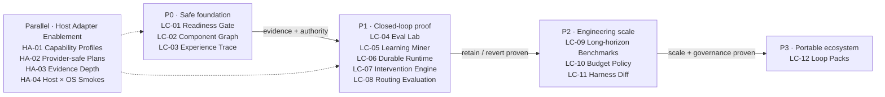

# Better Harness Product Roadmap

References: [Architecture](docs/ARCHITECTURE.md) ·
[Agent Work Loop](models/agent-work-loop.md) ·
[Loop Engineering](references/loop-engineering/README.md) ·
[Host Adapter Matrix](docs/adapters/README.md) ·
[Contributing a New Coding Agent Host](docs/adapters/contributing-new-coding-agent.md)

## Product Position

Better Harness is the evidence and control plane for improving Coding Agent
workflows. It is not another Coding Agent runtime.

| Better Harness owns | The host Coding Agent owns |
| --- | --- |
| Harness component identity, revision, activation, and rollback provenance | Model execution and native tool calls |
| Provider-neutral evidence, Task Episode, Experience Trace, and Loop Run contracts | Provider permissions, user interaction, subagents, worktrees, and hooks |
| Eval suites, trajectory review, comparisons, guardrails, and intervention decisions | Provider-specific execution of an approved bounded plan |
| Durable loop state, approval, budget, stop, resume, and audit contracts | Native installation, authentication, and runtime lifecycle |

The target operating loop is:

```text
Observe
-> Diagnose
-> Hypothesize
-> Plan a bounded intervention
-> Execute in an isolated host environment
-> Verify objective behavior and trajectory quality
-> Compare with a frozen baseline or holdout
-> Retain, narrow, revise, or revert
-> Re-exercise on a later comparable task
```

## Roadmap at a Glance



The diagram shows delivery order rather than every pairwise code dependency.
The acceptance table and each future spec own the exact gates. In particular,
no mutating runtime may bypass `LC-01`, and `LC-07` requires `LC-02`, `LC-04`,
and `LC-06`.

## Prioritized Roadmap

Work in dependency order. P0 establishes the authority and evidence boundaries
required by every later mutating or scheduled workflow. A checked item means the
implementation, tests, documentation, and required native evidence all support
the acceptance statement.

| Done | Priority | ID | Capability | Acceptance |
| --- | --- | --- | --- | --- |
| [ ] | P0 | LC-01 | Add a fail-closed Loop Runtime Readiness Gate. | Versioned readiness levels distinguish read-only observation, plan-only, human-approved apply, scheduled read-only, and scheduled bounded apply. Required `blocked`, `partial`, `unavailable`, or `failed` capabilities prevent the applicable run. |
| [ ] | P0 | LC-02 | Add a versioned Harness Component Graph. | Stable provider-and-scope-qualified component IDs, authorized revisions, activation evidence, typed relationships, frozen snapshots, bounded diffs, and real rollback references are available without exposing private content. |
| [ ] | P0/P1 | LC-03 | Define a cross-host Experience Trace contract and optional OTLP export. | A reader-safe, versioned JSONL trace preserves provider capability gaps, multi-session Task Episodes, subagent/worktree lineage, approvals, interruption/resume, component snapshot references, and structured stop reasons. Content-free OTLP export is opt-in. |
| [ ] | P1 | LC-04 | Add a trajectory-native Harness Eval Lab. | Versioned suites run objective validators before trajectory review; replay, pairwise comparison, held-out tasks, component ablation, judge disagreement, safety, and cost are reported separately. |
| [ ] | P1 | LC-05 | Mine learning candidates from ordinary normalized Task Episodes. | Deterministic facts plus bounded AI review produce evidence-linked candidates, abstentions, and coverage reasons without requiring adapter-supplied `learningPatternId`; positive and hard-negative fixtures measure precision, recall, and abstention. |
| [ ] | P1 | LC-06 | Add a Durable Loop Runtime. | `validate`, `plan`, `run`, `status`, `resume`, `stop`, and `verify` use separate plan/apply artifacts, append-only state, idempotent side effects, worktree or equivalent isolation, approvals, checkpoints, budgets, and fail-closed provider delegation. |
| [ ] | P1 | LC-07 | Turn the Intervention Ledger into an experiment engine. | A prediction and guardrails are frozen before apply; the run binds exact before/after component revisions, records every attempt, compares objective and trajectory evidence, and decides `retain`, `retain-with-narrower-scope`, `revise-and-retest`, `revert`, `retire`, or `needs-more-evidence`. |
| [ ] | P1/P2 | LC-08 | Evaluate context, Skill, Memory, Rule, MCP, workflow, and tool routing. | Evidence distinguishes expected applicability, discovery, loading, invocation, application, and decision impact; recall, precision, efficiency, false triggers, scope, staleness, and context cost remain explicit and non-mutating. |
| [ ] | P2 | LC-09 | Add long-horizon, multi-session software-evolution benchmarks. | Scenarios span milestones, interruptions, compaction, worktree or agent handoff, CI/review feedback, and later transfer checks while separating milestone progress from final success. |
| [ ] | P2 | LC-10 | Add budget-aware Loop policies. | Exact, provider-estimated, effort-proxy, and unavailable accounting stay distinct; retry, no-progress, escalation, human override, budget exhaustion, and stop decisions are structured and auditable. |
| [ ] | P2 | LC-11 | Produce Harness Diff as a PR and CI artifact. | Two frozen component snapshots yield a privacy-safe semantic diff covering activation, scope, permission, validation, evaluation, privacy, runtime, compatibility, eval delta, and rollback; CI blocks only on explicit repository policy. |
| [ ] | P3 | LC-12 | Explore portable Loop Packs and a community registry. | A signed, reviewable pack declares compatibility, permissions, state, privacy, evals, provenance, activation, migration, uninstall, and rollback. Discovery or installation never authorizes execution. |

## First Coherent Implementation Slice

Do not begin with a scheduler or open-ended autonomous runtime. Prove the
architecture with one bounded, end-to-end experiment:

1. Generate a frozen component snapshot for project-owned Rules, Skills, Hooks,
   Commands, and Workflows for one evidence-rich host.
2. Emit a trace covering one explicit Task Episode with tool, validation,
   approval, and stop events.
3. Define an Eval Suite with at least one objective validator and one trajectory
   rubric.
4. Persist an Intervention Proposal that changes exactly one project-owned
   component and freezes the prediction, primary metric, and guardrails.
5. Run baseline and candidate replays in isolated worktrees with identical
   selection policy and complete attempt accounting.
6. Produce a reader-safe `retain`, `retain-with-narrower-scope`, `revert`, or
   `needs-more-evidence` decision, then keep later-task transfer explicitly
   pending until a comparable Task Episode exists.

This slice is complete when its baseline and candidate artifacts are
reproducible and an exact prior component revision can be restored and
revalidated. Checkpoint/resume, idempotent recovery, and scheduled execution
remain part of `LC-06`, not prerequisites for this first architectural proof.

## Planning Baseline

This roadmap turns the 2026-07-30 Loop Engineering assessment at
`main@40011c1` into an implementation sequence and reconciles it with
`main@4b871d9`, which adds the WorkBuddy host adapter.

The `LC-*` and `HA-*` values below are roadmap IDs, not GitHub issue numbers.
Create a reviewable spec under `docs/specs/` before implementing any non-trivial
item. The [Host Adapter Matrix](docs/adapters/README.md) remains the canonical
source for current per-host capability and smoke-test claims; this roadmap does
not duplicate that matrix.

## Current Baseline

| Surface | Available foundation | Remaining boundary |
| --- | --- | --- |
| Evidence | Task Episodes, workspace-bounded evidence, and explicit `Present` / `Wired` / `Exercised` / `Outcome-supported` / `Missing` / `Unobserved` states | No cross-host Loop Run trace with component revision, worktree lineage, approval, resume, and stop topology |
| Assessment | Agent Work Loop checks, evidence bundles, analyze, checkup, report, render, repair, and fix-output recording | The primary product path still ends at `Observe -> Diagnose -> Report -> Recommend` |
| Learning | Loop Discovery references, learning-loop patterns, state guidance, and an Intervention Ledger | Ordinary normalized episodes do not yet produce a complete native learning-signal discovery and experiment lifecycle |
| Host coverage | Configured-asset and session-evidence routes for Claude Code, Codex, Qoder, Cursor, Qwen Code, GitHub Copilot, Pi, and WorkBuddy | Installation, runtime, output, event, model, token, hook, and operating-system proof still varies by host |
| Safety | Issues #11-#18 are closed and their fail-closed regression contract is implemented in [Fail-Closed Review and Privacy Boundaries](docs/specs/2026-07-29-11-18-review-boundary-hardening.md) | There is no unified, machine-readable readiness gate for plan, approved apply, scheduled read-only, or scheduled bounded apply |
| Runtime | Loop Spec, automation-readiness, primitive, state-ledger, and intervention concepts are documented | There is no canonical `loop plan / run / resume / stop / verify` protocol or side-effect journal |

Completed adapter-enablement work includes the help-only `agent-customize` path
(`A-04`), support-declaration consistency tests (`A-06`), deterministic Cursor
plugin-ID matching removal (`U-01`), the new-host contribution checklist
(`X-02`), and provider-aware checkup plan/apply fail-closed binding (`HA-02`).
These are prerequisites, not proof that a closed improvement loop is available.

## System Invariants

- Configured presence never proves observed use.
- Same-window repair verification never proves later effectiveness.
- Unknown, unavailable, partial, or invalid evidence never becomes a clean
  result.
- Every mutation has a frozen pre-state, explicit authority, isolated execution,
  objective validation, and a resolvable rollback or compensation boundary.
- Every loop declares a trigger, stable input, state policy, observability,
  evaluation, budget, stop condition, and human gate where required.
- Scores summarize evidence; they do not create findings, prove causality, or
  authorize mutation.
- Cross-provider normalization preserves provider provenance and unavailable
  fields instead of inventing parity.
- Raw private transcripts, secrets, absolute home paths, and unauthorized Memory
  content never enter public artifacts.
- Objective acceptance, trajectory quality, safety, cost, and evaluator
  confidence remain separate result dimensions.

## Host Adapter Enablement Track

Adapter work continues in parallel, but adding another scanner or host does not
advance the Loop Control Plane unless it strengthens an evidence, authority, or
execution dependency above.

| Done | Priority | ID | Capability | Acceptance |
| --- | --- | --- | --- | --- |
| [ ] | P0 | HA-01 | Add explicit `full-session`, `inventory-only`, and `unsupported` checkup capability profiles. | A configured-only provider can complete inventory without session evidence and cannot emit cleanup or mutation candidates. |
| [x] | P0 | HA-02 | Make checkup planning provider-aware and fail closed. | Source references and provider-home paths bind to one explicit provider; no plan can route through another host's executor or configuration root. |
| [ ] | P1 | HA-03 | Close provider-specific evidence-depth gaps. | Model, usage, hook, lifecycle, and mutation fields remain unavailable until a stable native source and drift fixtures exist; provider-native apply stays read-only where no accepted mutation contract exists. |
| [ ] | P2 | HA-04 | Add Host x OS native smoke coverage. | Every claimed host/OS combination separately proves install or discovery, inventory, evidence collection, analysis, output validation, upgrade or reinstall, and privacy boundaries. |

## Definition of Done

A roadmap capability is complete only when:

- its canonical owner, versioned contract, CLI or public API, fixtures, tests,
  documentation, and reader projection agree;
- machine modes keep stdout parser-safe and return non-zero or a documented
  non-success envelope for invalid scope, runtime failure, and blocked policy;
- Windows, macOS, and Linux path and process behavior is automated where the
  capability claims cross-platform support;
- native host evidence is reported separately from source, unit, fixture,
  package, browser, and CI evidence;
- unsupported behavior fails before reading private data or changing files;
- every state-changing path separates plan from apply, requires the applicable
  readiness level and approval, journals side effects, verifies the result, and
  proves rollback or compensation;
- later effectiveness requires a valid comparable or held-out window and never
  follows from same-window completion alone.

The roadmap epic is complete when Better Harness can detect one repeated,
evidence-supported Harness problem, bind it to an exact component revision,
execute a bounded human-approved intervention, evaluate it objectively and at
trajectory level, retain or revert it, and report later comparable-task transfer
without overstating unavailable evidence.

## Non-goals

- Do not build another general-purpose Coding Agent runtime.
- Do not force all hosts to expose identical events or capabilities.
- Do not create synthetic session, hook, model, token, cost, activation, or
  transfer evidence.
- Do not let an evaluator, score, or package discovery authorize mutation.
- Do not enable scheduled bounded apply before the readiness, isolation,
  approval, idempotency, stop, and rollback contracts pass.
- Do not launch a public registry before the Loop Pack schema and threat model
  have been validated with local read-only prototypes.

## Open Decisions

| Decision | Default until resolved |
| --- | --- |
| Which host should prove the first coherent slice? | Choose during the `LC-02`/`LC-03` spec using current native evidence completeness; do not infer it from adapter count or package support. |
| Should any provider support automatic apply? | Keep read-only or human-reviewed until `LC-01`, `LC-06`, and a provider-native mutation contract are accepted. |
| Can a Task Episode span Sessions? | Only with an explicit task identity or reviewed continuation; temporal proximity is insufficient. |
| Should traces export to OpenTelemetry? | Keep export optional, content-free by default, and secondary to the Better Harness trace contract. |
| When can an intervention be called effective? | Only after a frozen comparison passes its primary metric and guardrails; later transfer remains a separate claim. |
